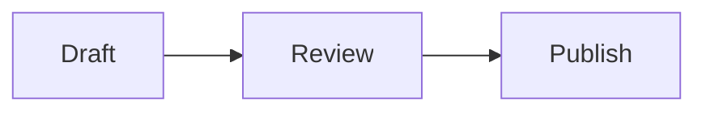

# Markdown Viewer

A Windows desktop app for browsing, previewing, and editing Markdown files in a selected folder. Once installed, it also appears in File Explorer's **Open with** menu for `.md` files.

## Overview

Markdown Viewer is a WinUI app built with .NET. It lets you choose a folder, lists Markdown files from that folder and its subfolders, and shows each file in two tabs:

- `Preview` renders a readable Markdown view.
- `Code` shows the editable source text.

The preview supports common Markdown shapes such as headings, paragraphs, lists, block quotes, horizontal rules, fenced code blocks, tables, inline code markers, emphasis markers, links, and Mermaid diagrams.

## App Workflow

1. Choose a folder. The selected folder path stays visible in the header.
2. Use **File view** to switch between a flat `.md` list with relative paths and a folder tree. Both views contain Markdown files only.
3. Read it in the `Preview` tab. Preview text can be selected and copied with the
   standard Windows mouse and keyboard shortcuts. Press `Ctrl+A`, then `Ctrl+C`,
   to copy the complete rendered preview, including tables.
4. Click `Edit` to change the source in the `Code` tab.
5. Save to overwrite the file, or revert to discard edits. Use the refresh button to rescan the folder when files change outside the app.
6. Use the theme button to switch between light and dark mode.

Mermaid diagrams use a fenced block labeled `mermaid`:

````markdown

````

You can also right-click an `.md` file in File Explorer and choose **Open with > Markdown Viewer**. The app opens that file and lists the other Markdown files in its containing folder.

The app blocks folder changes and file switches while there are unsaved edits, so changes are not lost by accident.

## Development Workflow

Requirements:

- Windows 10 version 1809 or later.
- .NET 10 SDK.

Restore and build:

```powershell
dotnet restore MarkdownViewerApp.slnx
dotnet build MarkdownViewerApp.slnx -c Debug
```

Run:

```powershell
dotnet run --project MarkdownViewerApp\MarkdownViewerApp.csproj
```

Use conventional commit messages for repository changes:

```powershell
git add README.md
git commit -m "docs: add project README"
git push
```

## Project Structure

```text
MarkdownViewerApp.slnx
MarkdownViewerApp/
  App.xaml
  MainWindow.xaml
  MainPage.xaml
  MainPage.xaml.cs
  MarkdownViewerApp.csproj
  Assets/
```

- `MainWindow` sets up the app window and navigates to `MainPage`.
- `MainPage` owns folder picking, file loading, editing, saving, and Markdown preview rendering.
- `Assets` contains app icons and package images.
